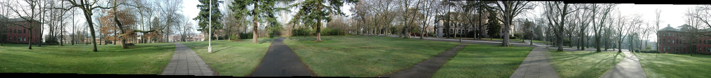
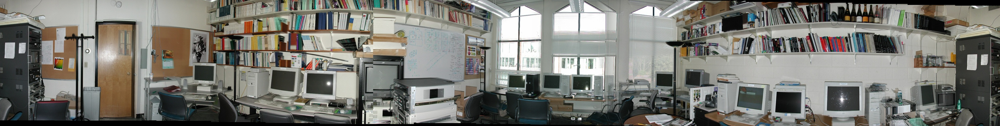
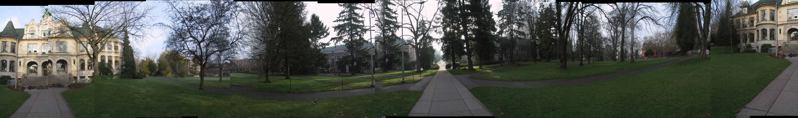
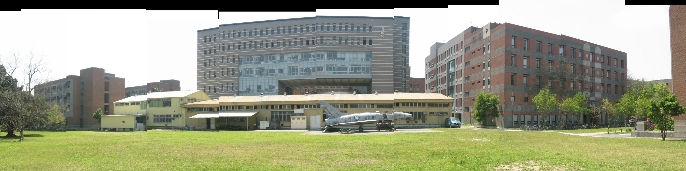

# NTU VFX2023 Homework2: Image Stitching (Panorama)

## Description:
website: https://www.csie.ntu.edu.tw/~cyy/courses/vfx/21spring/assignments/proj2/

### TL;DR:
1. cylindrical projection (focal lengths are estimated by [AutoStitch](http://matthewalunbrown.com/autostitch/autostitch.html))
2. feature detection - Harris Corner Detection 
3. feature descriptor - SIFT descriptor
4. feature matching - L2-distance brute force
5. image matching - RANSAC
6. image blending - linear blending at the intersection between 2 images


## Member:
- 電信所碩一 顏子鈞
- 電信所碩一 陳詠源

## Dependencies:
please install them using ```pip install -r requirements.txt```. packages used in our code:
- numpy, opencv-python, matplotlib, scikit-image

## Execution:
Generating Panorama:
```
$ cd code
$ python main.py --dataset <name_of_dataset>
```
Note:
- choices of ```<name_of_dataset>```: 
    - parrington (set as default)
    - grail
    - denny
    - csie

## Results:

### parrington:



### grail:



### denny: (w/o tripod)



### csie: (w/o tripod)


